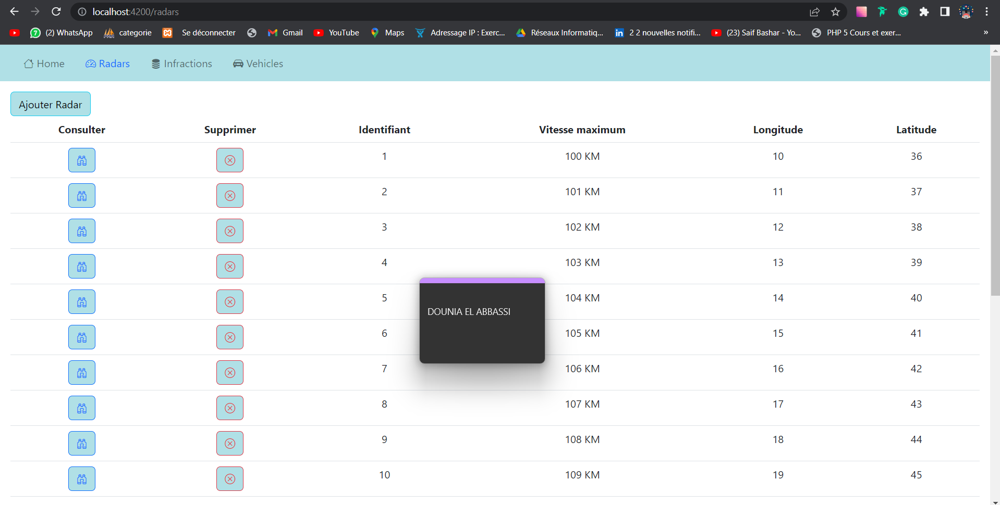

<H1>Contrôle et Projet Programmation Distribuée </H1>

On souhaite créer un système distribué basé sur les micro-services Cette application devrait
permettre de gérer et d’automatiser le processus des infractions concernant des véhicules
suites à des dépassement de vitesses détectés par des radars automatiques. 
Le système se compose de trois micro-services :

  • Le micro-service qui permet de gérer les radars. Chaque radar est défini par son id, sa
   vitesse maximale, des coordonnées : Longitude et Latitude.

  • Le micro-service d’immatriculation qui permet de gérer des véhicules appartenant des
   propriétaires. Chaque véhicule appartient à un seul propriétaire. Un propriétaire est
   défini par son id, son nom, sa date de naissance, son email et son email. Un véhicule
   est défini par son id, son numéro de matricule, sa marque, sa puissance fiscale et son modèle.

  • Le micro-service qui permet de gérer les infractions. Chaque infraction est définie par
  son id, sa date, le numéro du radar qui a détecté le dépassement, le matricule du
  véhicule, la vitesse du véhicule, la vitesse maximale du radar et le montant de l’infraction.

En plus des opérations classiques de consultation et de modifications de données, le système
doit permettre de poster un dépassement de vitesse qui va se traduire par une infraction. En
plus, il doit permettre à un propriétaire de consulter ses infractions.

<H3>Diagramme de classe global du projet</H3>

<H3>Le micro-service Immatriculation</H3>

<h4>Test GRPC</h4>

Get Proprietaire :

Update Proprietaire : 

 
 
Get Proprietaire By id:

   
  
Save Proprietaire :

   
  
Get Voitures :
  
 
Save Voiture :
 
  
 
 Update Voiture :
  
  
 
Delete Voiture :
 
  

<h4>Test GraphQL </h4>

<h4>Test Rest </h4>

<H3>Le micro-service Infractions</H3>

<h4>Test Navigateur </h4>

Get Infractions :

Get Infractions By id:

<h4>Test PostMan </h4>

Get Infractions:

Save Infraction:

Update Infraction:

Delete Infraction:

<H3>Le micro-service Radar</H3>

 Chaque dépassement de vitesse, ce service
devrait consulter le service d’immatriculation pour récupérer les informations sur le
propriétaire du véhicule. Ensuite il fait appel au service Infraction pour générer une
nouvelle infraction. La communication entre les services peut se faire au choix entre
REST, SOAP, GRPC ou GraphQL.

Get Radars

Get Radars By Id

<H3>Mettre en place les services techniques de l’architecture micro-service (Gateway,
Eureka Discovery service)</H3>

Gateway 
 
 Get Radars

Eureka Discovery service

Frontend avec Angular
 

 

  

  
  
 

